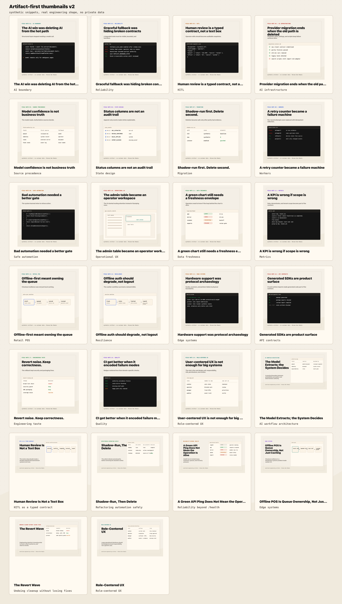

# Engineering Field Notes

Sanitized writing material from production engineering work: AI workflow boundaries, human review systems, operator tooling, offline retail, reliability, CI, and rollback discipline.

This repository is a public companion to my LinkedIn and Medium writing. It does not contain private source code, customer data, screenshots, documents, hostnames, credentials, or internal system names. The artifacts here are synthetic but shaped by real engineering lessons.

## Current Focus

I build operational software where messy real-world workflows become typed, observable, reliable systems.

The main themes:

- AI is useful when bounded by deterministic contracts and production feedback loops.
- Human review is strongest when it produces typed, auditable snapshots.
- Operator tools should route attention, not just render database rows.
- Large interfaces should be role-centered: cashier, operator, manager, auditor, and admin screens need different surfaces.
- Offline-first checkout is queue ownership, not just caching.
- Reliability includes loops, queues, freshness, backpressure, and visible degradation.
- Good CI encodes domain failure modes, not just generic badge collection.
- Mature rollback means reverting noise while preserving correctness.

## Repository Map

| Path | Purpose |
|---|---|
| `content/linkedin-calendar.md` | Six-week LinkedIn publishing plan |
| `content/medium-outlines.md` | Six long-form article outlines |
| `content/privacy-rules.md` | Public-writing safety rules |
| `content/post-drafts/` | First public post drafts |
| `assets/thumbnails/png/` | Ready-to-upload thumbnails |
| `assets/thumbnails/svg/` | Editable thumbnail sources |
| `assets/contact-sheet.png` | Overview of the thumbnail set |
| `scripts/generate-thumbnails.mjs` | Deterministic thumbnail generator |

## Thumbnail System

The thumbnails use sanitized engineering artifacts instead of generic illustrations:

- diffs
- terminal traces
- event logs
- field-authority tables
- queue and state-machine sketches
- CI check output
- rollback decision matrices
- role maps for operational UX

Preview:



## Writing Principles

1. Show engineering judgment, not hype.
2. Use synthetic examples for public artifacts.
3. Avoid private names, raw payloads, production counts, exact incident timelines, hostnames, credentials, and customer documents.
4. Prefer concrete lessons: deleted fallback paths, typed review snapshots, domain gates, event logs, freshness envelopes, queue ownership, rollback decisions.
5. Be precise about claims. Do not imply full automation, perfect accuracy, or universal architecture rules.

## Regenerate Thumbnails

The generator writes SVG assets and a manifest. Exporting PNGs requires `rsvg-convert`.

```bash
node scripts/generate-thumbnails.mjs
```

The currently committed PNGs are already exported at:

- LinkedIn: `1200x1200`
- Medium: `1600x900`
